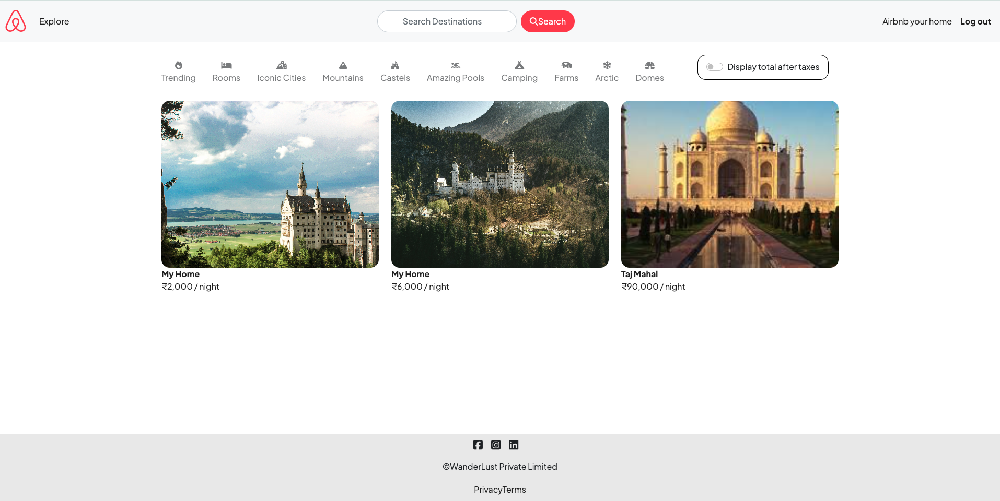

# WanderLust-Travel-Website

At WanderLust, we believe that every journey begins with a place to call home. Inspired by the global success of Airbnb, our platform is dedicated to connecting travelers with unique and welcoming accommodations. Whether you're looking for a cozy cottage, a chic city apartment, or a serene beach house, WanderLust has the perfect place for you.


# Take a look of the website 

```bash
https://wanderlust-travel-website-7k6a.onrender.com/listings
```



## Table of Contents

- [Overview](#Overview)
- [Features](#features)
- [Dependencies](#dependencies)
- [Setup](#setup)
- [Usage](#usage)
- [Contributors](#contributors)


## Overview

- Inspired by Airbnb: A platform for listing and renting homes.
- Home Listings: Easily list your home for rent.
- Map Integration: View exact home locations on maps.
- User Reviews: Write reviews and rate homes with stars.
- Authentication: Secure, authenticated user experience.


## Features

- Map Location: Our interactive map feature allows you to easily find and list properties based on location. Whether you're searching for a city apartment, a rural retreat, or a coastal cottage, our map view helps you pinpoint the perfect spot for your next adventure.

- Host Reviews: Hear from our community of satisfied hosts and travelers. Our review system ensures transparency and trust, helping you make informed decisions. Here’s what our users have to say:

- Listing Your Home: Listing your property on WanderLust is quick and easy. Our step-by-step process guides you through adding photos, writing descriptions, and setting availability. With just a few clicks, your home can be viewed by travelers worldwide.

- Cloud Data Storage: Rest assured that your data is safe with us. WanderLust utilizes cloud storage to securely store all property listings, user information, and transaction details. This ensures that your data is always accessible, backed up, and protected against loss.


## Dependencies

- @mapbox/mapbox-sdk
- cloudinary: ^1.41.3 (specific version recommended)
- connect-flash
- connect-mongo
- cookie-parser
- dotenv
- ejs
- ejs-mate
- express
- express-session
- joi
- method-override
- mongodb
- mongoose
- multer
- multer-storage-cloudinary
- nodemon
- passport
- passport-local
- passport-local-mongoose


## Setup

1. Clone the repository:

```bash
git clone https://github.com/OmShankarDeshmukh01/WanderLust-Travel_Website.git
cd WanderLust-Travel_Website
```

2. Install the dependencies:

```bash
npm install
```


## Usage

```bash
node app.js
```

Access the app in your web browser at `localhost:8080/listings`.


## Contributors

- Om Shankar Deshmukh ([LinkedIn](https://www.linkedin.com/in/om-shankar-deshmukh-7431b9245/))
